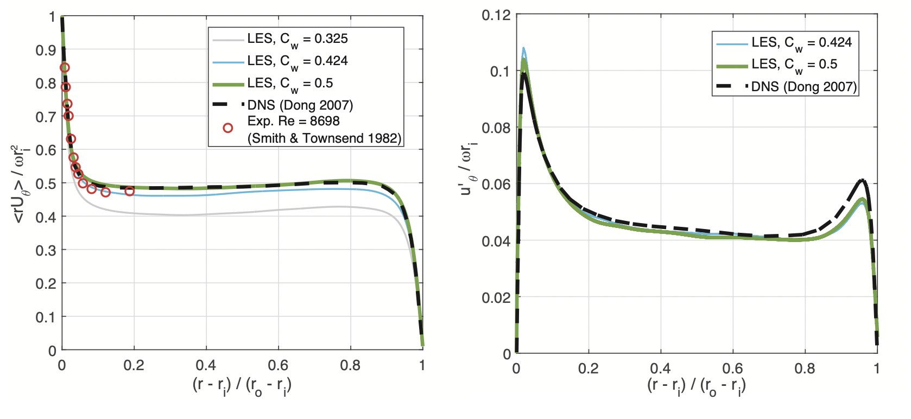

# Model description

This numerical model simulates Taylor-Couette flow using Large-Eddy Simulations. This solves the filtered continuity and Navier-Stokes equations which resolve the turbulent motion down to a point (defined by a top-hat filter $\Delta = V^{1/3}$ based on the cell volume, $V$). A wall adapting local eddy-viscosity (WALE) approach is implemented for the sub-grid-scale eddy-viscosity.

This repository includes the complete OpenFOAM (v4) case file configured for a validation test case we performed in our previously published work:

| | |
Stafford, J., et al. **Real-time Monitoring and Hydrodynamic Scaling of Shear Exfoliated Graphene**. _2D Materials._ 2021;8:025029 [doi:10.1088/2053-1583/abdf2f](https://doi.org/10.1088/2053-1583/abdf2f).

All details on the LES model and its usage are available in this open-access manuscript and the associated supplementary information. The OpenFOAM case can be modified to match your own geometry and operating parameters. For example, it can be used to match the [experimental model](https://github.com/stafforj/Taylor-Couette-Flow/tree/main/Experimental-model) also described in this repository. To this end, the model has been configured for generalised use. Variations to geometry, mesh parameters, Reynolds number and fluid properties are performed within the [/system/cylinderRe](./TaylorCouette-LES/system/cylinderRe) text file.  

Below shows a comparison between this model and other experimental and DNS studies for angular momentum (left) and root-mean-square azimuthal velocity fluctuation profiles across the fluid gap. This was used to refine the sub-grid-scale model coefficient ($C_w$).

