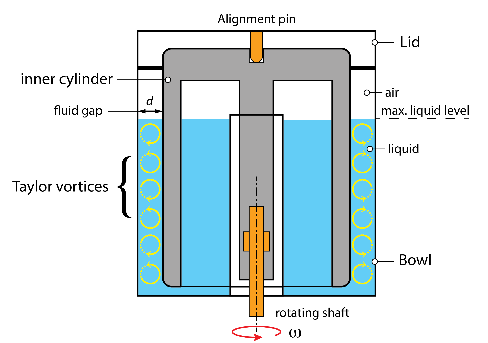
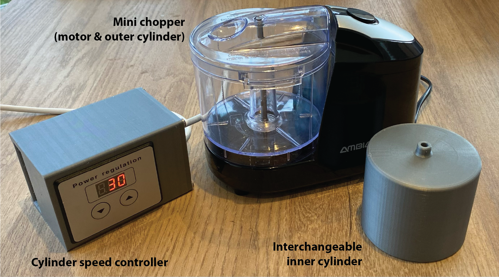
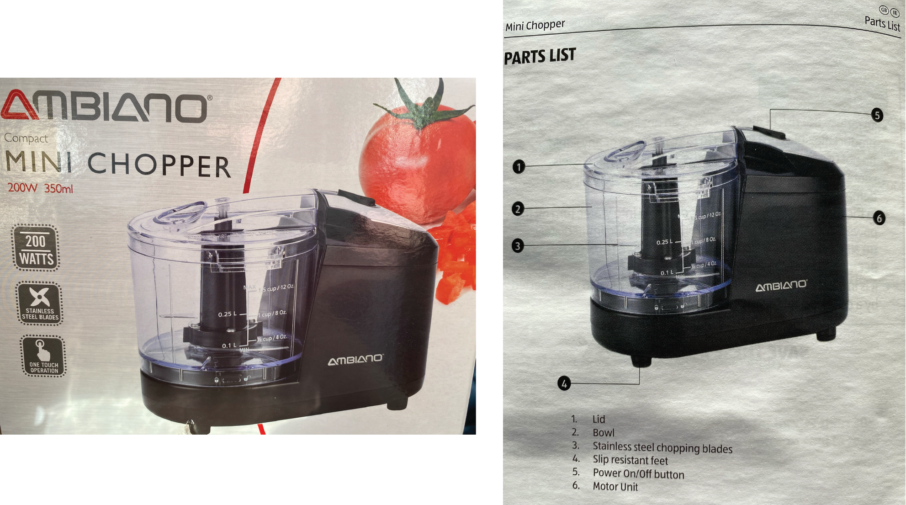
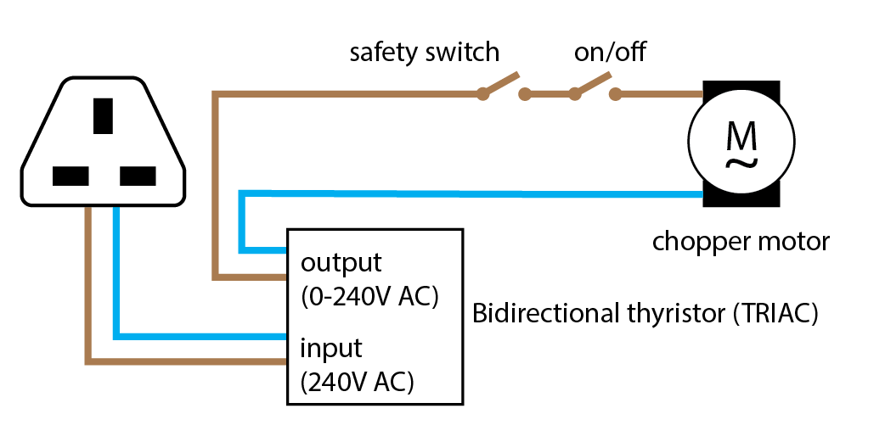
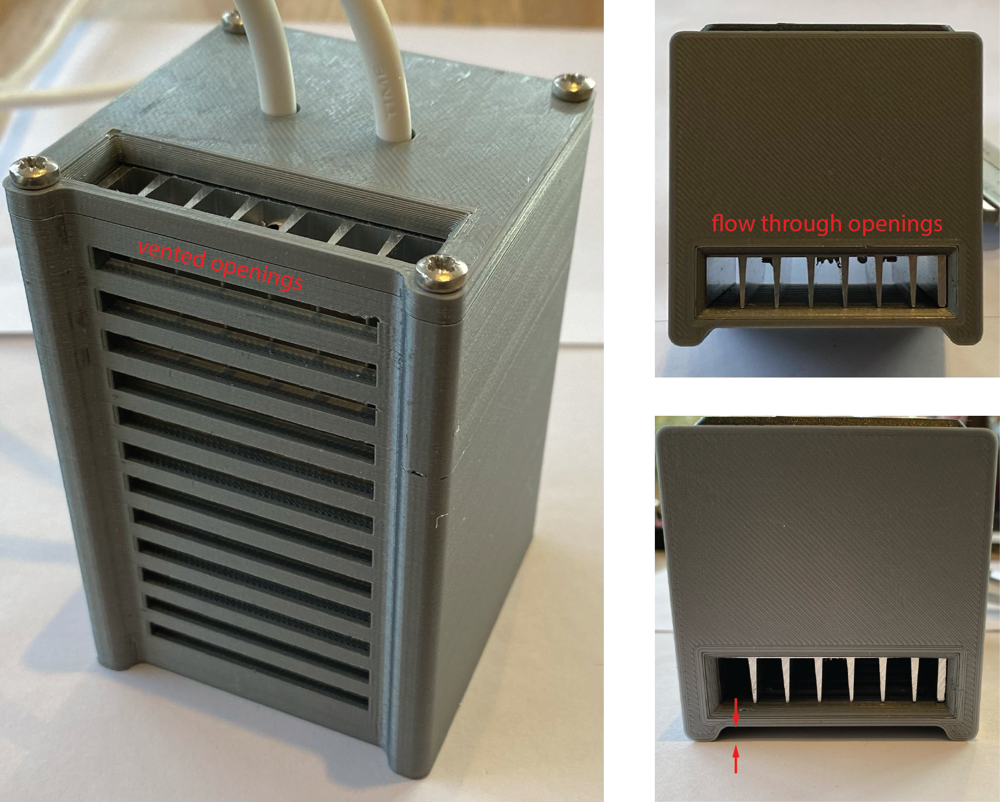
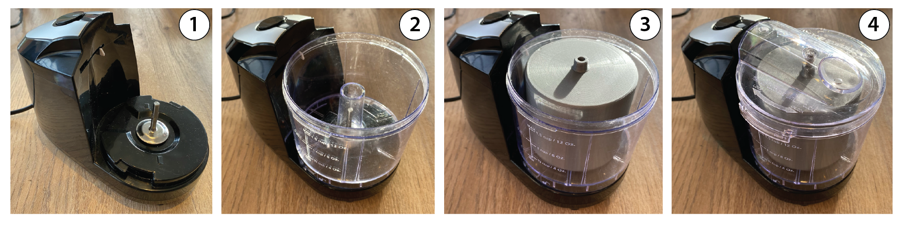

# Build instructions

This section presents the concept, physical construction, wiring, and device assembly for a low-cost Taylor-Couette flow visualisation experiment. 

## Concept

Present concept

Image of three components

Image of mini chopper

## Construction
The device is constructed from a mini food chopper, modified to rotate a cylinder at controllable rotational speeds. The speed control is necessary to adjust the flow behaviour and explore the flow instabilities that emerge at different Reynolds numbers ($R$). The estimated that the total cost of this is 

## Wiring

Wiring diagram

Motor control unit

Module enclosure and ventilation

## Device assembly

Device assembly

