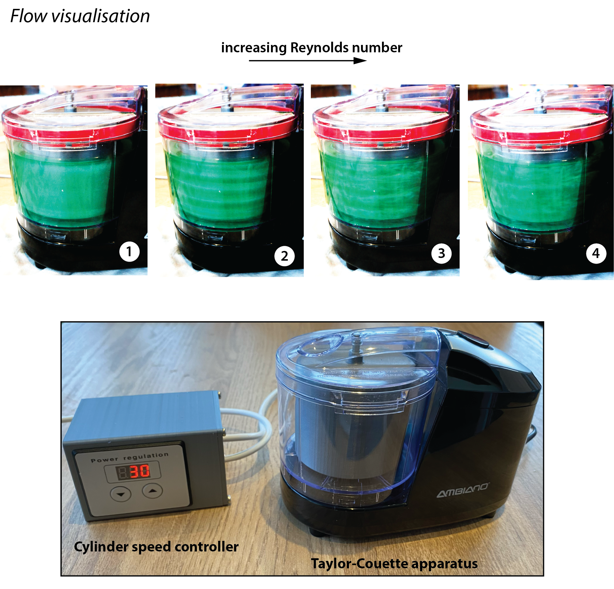
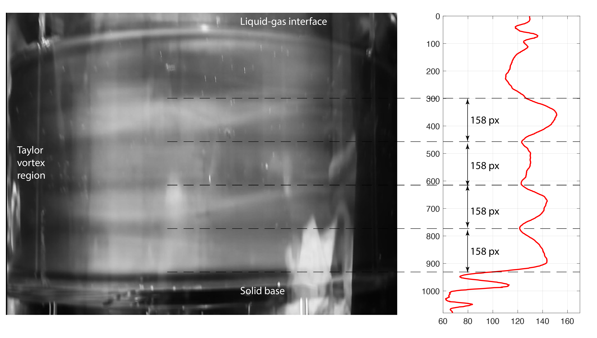

# Taylor-Couette-Flow

_Open-source tools that can be used to explore the fluid dynamics of Taylor-Couette flows. The repository includes build instructions for a low-cost experiment (e.g., as a demonstrator in education), and a LES model for predicting detailed flow field information._ 

The experiment is capable of generating a wide range of hydrodynamic conditions and flow instabilities. As evidenced by the sweep of Reynolds number above. The flow and Taylor vortices were visualised using a water-based rheoscopic fluid, colored using food dye. Another example is shown in the short clip below.  

The Taylor vortex flow is apparent above, and the characteristic pattern of "bands" are also revealed when taking an ensemble-average of the video frames (greyscale image below is an average of N = 1300 frames). The profile of image intensity is plotted adjacent to this frame-average, indicating the transition between bands which occurs in a repeatable pattern (away from the liquid-gas interface and cylinder base).  

